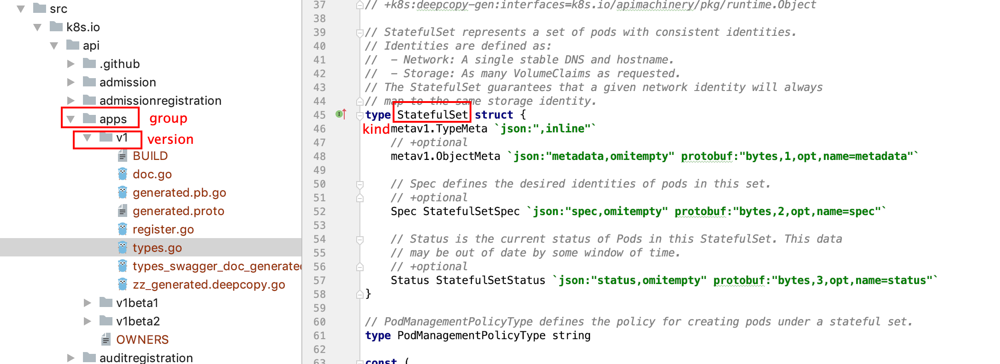

# client-go 源码解读

项目下载地址： 

kubernetes https://github.com/kubernetes/kubernetes

client-go     https://github.com/kubernetes/client-go.git

> kubernetes 项目中包涵了client-go项目，所以直接下载kubernetes 的源码就可以啦

## 1. kubernetes中需要了解的目录结构

kubenetes 中主要的代码在 staging/src/k8s.io 中

### k8s.io/api

目录中包含了kubernetes所有原生的接口

例如常见的 deployment  deamset  StatefulSet pod  pv pvc storageClass 等等。

整个目录结构与文件结构与YAML 文件结构类似

如上图所示，api下的第一级目录对应的是 group，在group 下对应了多个api版本 v1、v1beta1、v1beta2。

在v1目录的type.go 文件中 定义了很多的k8s 对象，例如上图的statefuleSet，对应的是YAML 文件的kind 字段。

statefuleSet 是一个结构体，结构体中包涵 Meta  Spec 和 Status 与YAML 文件的定义一致。

我们可以使用 types.go 中的结构体来定义我们的k8s 对象。

### k8s.io/apimachinery

定义了需要用到的公共的结构体

例如 apis/meta/v1/types.go中 定义了 TypeMeta ObjectMeta   LabelSelector

## 2. client-go

