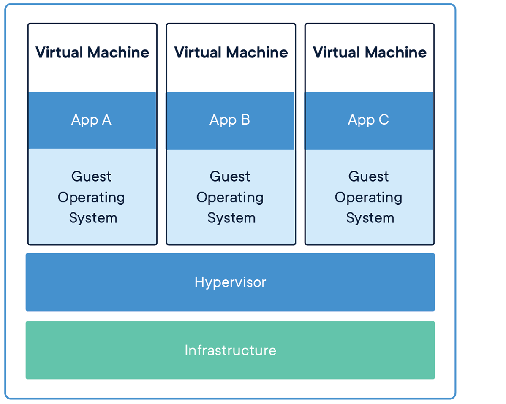

# 00-Docker基础概念

[TOC]

## 容器标准化组织 OCI 

[OCI 官网](https://opencontainers.org/)

Linux基金会于2015年6月成立OCI（Open Container Initiative）组织，旨在围绕容器格式和运行时制定一个开放的工业化标准。该组织一成立便得到了包括谷歌、微软、亚马逊、华为等一系列云计算厂商的支持。

制定容器的工业化标准，与厂商无关，反垄断。

 **OCI 容器标准化宗旨**

标准化容器的宗旨具体分为如下五条。

1. **操作标准化**：容器的标准化操作包括使用标准容器创建、启动、停止容器，使用标准文件系统工具复制和创建容器快照，使用标准化网络工具进行下载和上传。

2. **基础设施无关**：无论是个人的笔记本电脑还是AWS S3，亦或是OpenStack，或者其它基础设施，都应该对支持容器的各项操作。

3. **内容无关**：内容无关指不管针对的具体容器内容是什么，容器标准操作执行后都能产生同样的效果。如容器可以用同样的方式上传、启动，不管是PHP应用还是MySQL数据库服务。 --系统内核

4. **为自动化量身定制**：制定容器统一标准，是操作内容无关化、平台无关化的根本目的之一，就是为了可以使容器操作全平台自动化。

5. **工业级交付**：制定容器标准一大目标，就是使软件分发可以达到工业级交付成为现实。

> 关键点：
>
> 1.   OCI  制定容器的工业化标准，与厂商无关，反垄断。
> 2.   OCI 制定标准，厂商根据标准提供基于自己底层的 容器运行时 的 实现。
> 3.   容器运行时的实现有很多： containerd ，rkt，vSphere CRX，CRI-O   

## 容器与虚拟机的区别

容器和虚拟机具有类似的资源隔离和分配优势，但功能不同。因为容器是虚拟化操作系统而不是虚拟化硬件。容器更便携，更高效。

**容器**

1. 容器是应用层的抽象，它将代码和依赖关系打包在一起。
2. 多个容器可以在同一台机器上运行，并与其他容器共享操作系统内核，每个容器在用户空间中作为独立进程运行。
3. 容器占用的空间比VM少（容器映像的大小通常为几十MB），可以处理更多的应用程序，并且需要更少的VM和操作系统。

**虚拟机**

1. 虚拟机（VM）是物理硬件的抽象，将一台服务器转变为多台服务器。
2. 虚拟机管理程序允许多台虚拟机在一台计算机上运行。
3. 每个VM都包含操作系统的完整副本，应用程序，必要的二进制文件和库 - 占用数十GB。启动慢。

## docker 

### docker 架构

[docker 架构文档](https://docs.docker.com/get-started/overview/#the-underlying-technology)

### Docker Engine 

volumes： 容器存储管理

Networking： 容器网络管理

Orchestration：容器编排

Distribution/BuildKit：容器打包运送，存储和交付的Docker工具集。

**containerd：容器运行时**

## containerd & RunC

[了解有关containerd的更多信息](https://containerd.io/)

containerd是一个行业标准的核心容器运行时，强调简单性，健壮性和可移植性。它可用作Linux和Windows的守护程序，可以管理其主机系统的完整容器生命周期：映像传输和存储，容器执行和监视，低级存储和网络附件等。

containerd旨在嵌入到更大的系统中，而不是由开发人员或最终用户直接使用。

containerd包含一个守护进程，通过本地UNIX套接字暴露gRPC API。API是一种低级API，旨在用于更高层的包装和扩展。它还包括`ctr`专为开发和调试目的而设计的准系统CLI()。它使用[runC](https://github.com/opencontainers/runc)根据[OCI规范](https://www.opencontainers.org/about)运行容器。

> docker的容器管理主要是通过containerd完成的，containerd提供了一个行业标准的核心容器运行时。
> 
> 关键点：
> 
> 1. containerd API是一种低级API，不能被用户直接使用。
> 2. 我们使用Docker的Docker命令，其实是使用的DockerClient。
> 3. containerd + runC 实现了 OCI 的容器运行时标准。

## 总结

通过本节应该完成以下目标：

1. 对容器有了基本的了解，容器是标准化的软件单元，对软件及软件环境进行了封装。

2. 容器的管理是通过containerd完成的，containerd提供了一个行业标准的核心容器运行时。

3. docker提供了对containerd的API封装，提供了用户访问的CLI接口。
