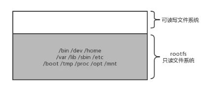

# 01-Docker 虚拟化原理

[TOC]

**容器的核心技术是 Cgroup + Namespace。**

容器  =  cgroup + namespace + rootfs + 容器引擎

- Cgroup： 资源控制
- namespace： 访问隔离
- rootfs：文件系统隔离。镜像的本质就是一个rootfs文件
- 容器引擎：生命周期控制

##  Cgroup

Cgroup 是 Control group 的简称，是 Linux 内核提供的一个特性，用于限制和隔离一组进程对系统资源的使用。对不同资源的具体管理是由各个子系统分工完成的。

| 子系统     | 作用                                     |
| ---------- | ---------------------------------------- |
| devices    | 设备权限控制                             |
| cpuset     | 分配指定的CPU和内存节点                  |
| CPU        | 控制CPU使用率                            |
| cpuacct    | 统计CPU使用情况                          |
| memory     | 限制内存的使用上限                       |
| freezer    | 暂停Cgroup 中的进程                      |
| net_cls    | 配合流控限制网络带宽                     |
| net_prio   | 设置进程的网络流量优先级                 |
| perf_event | 允许 Perf 工具基于 Cgroup 分组做性能检测 |
| huge_tlb   | 限制 HugeTLB 的使用                      |

在 Cgroup 出现之前，只能对一个进程做资源限制，如 `ulimit` 限制一个进程的打开文件上限、栈大小。而 Cgroup 可以对进程进行任意分组，如何分组由用户自定义。

### cpuset 子系统
  cpuset 可以为一组进程分配指定的CPU和内存节点。 cpuset 一开始用在高性能计算上，在 NUMA(non-uniform memory access) 架构的服务器上，通过将进程绑定到固定的 CPU 和内存节点上，来避免进程在运行时因跨节点内存访问而导致的性能下降。

cpuset 的主要接口如下：

- cpuset.cpus:       允许进程使用的CPU列表
- cpuset.mems： 允许进程使用的内存节点列表

### cpu 子系统
 cpu 子系统用于限制进程的 CPU 利用率。具体支持三个功能
 第一，CPU 比重分配。使用 cpu.shares 接口。
 第二，CPU 带宽限制。使用 cpu.cfs_period_us 和 cpu.cfs_quota_us 接口。
 第三， 实时进程的 CPU 带宽限制。使用 cpu_rt_period_us 和 cpu_rt_quota_us 接口。

### cpuacct 子系统
 统计各个 Cgroup 的 CPU 使用情况，有如下接口：

- cpuacct.stat: 报告这个 Cgroup 在用户态和内核态消耗的 CPU 时间，单位是 赫兹。
- cpuacct.usage： 报告该 Cgroup 消耗的总 CPU 时间。
- cpuacct.usage_percpu：报告该 Cgroup 在每个 CPU 上的消耗时间。

### memory 子系统
 限制 Cgroup 所能使用的内存上限。

- memory.limit_in_bytes：设定内存上限，单位字节。
   默认情况下，如果使用的内存超过上限，Linux 内核会试图回收内存，如果这样仍无法将内存降到限制的范围内，就会触发 OOM，选择杀死该Cgroup 中的某个进程。
- memory.memsw,limit_in_bytes: 设定内存加上交换内存区的总量。
- memory.oom_control： 如果设置为0，那么内存超过上限时，不会杀死进程，而是阻塞等待进程释放内存；同时系统会向用户态发送事件通知。
- memory.stat: 报告内存使用信息。

### blkio
 限制 Cgroup 对 阻塞 IO 的使用。

- blkio.weight: 设置权值，范围在[100, 1000]，属于比重分配，不是绝对带宽。因此只有当不同 Cgroup 争用同一个 阻塞设备时才起作用
- blkio.weight_device： 对具体设备设置权值。它会覆盖上面的选项值。
- blkio.throttle.read_bps_device: 对具体的设备，设置每秒读磁盘的带宽上限。
- blkio.throttle.write_bps_device: 对具体的设备，设置每秒写磁盘的带宽上限。
- blkio.throttle.read_iops_device: 对具体的设备，设置每秒读磁盘的IOPS带宽上限。
- blkio.throttle.write_iops_device: 对具体的设备，设置每秒写磁盘的IOPS带宽上限。

### devices 子系统
 控制 Cgroup 的进程对哪些设备有访问权限

- devices.list: 只读文件，显示目前允许被访问的设备列表，文件格式为
   `类型[a|b|c] 设备号[major:minor] 权限[r/w/m 的组合]`
   a/b/c 表示 所有设备、块设备和字符设备。
- devices.allow： 只写文件，以上述格式描述允许相应设备的访问列表。
- devices.deny： 只写文件，以上述格式描述禁止相应设备的访问列表。

##  Namespace

Namespace 是将内核的全局资源做封装，使得每个namespace 都有一份独立的资源，因此不同的进程在各自的namespace内对同一种资源的使用互不干扰。
 举个例子，执行`sethostname`这个系统调用会改变主机名，这个主机名就是全局资源，内核通过 **UTS Namespace**可以将不同的进程分隔在不同的 UTS Namespace 中，在某个 Namespace 修改主机名时，另一个 Namespace 的主机名保持不变。

目前，Linux 内核实现了6种 Namespace。

| Namespace | 作用                                |
| --------- | ----------------------------------- |
| IPC       | 隔离 System V IPC 和 POSIX 消息队列 |
| Network   | 隔离网络资源                        |
| Mount     | 隔离文件系统挂载点                  |
| PID       | 隔离进程ID                          |
| UTS       | 隔离主机名和域名                    |
| User      | 隔离用户和用户组                    |

与命名空间相关的三个系统调用：
 `clone`创建全新的Namespace，由clone创建的新进程就位于这个新的namespace里。创建时传入 flags参数，可选值有 CLONE_NEWIPC, CLONE_NEWNET, CLONE_NEWNS, CLONE_NEWPID, CLONE_NEWUTS, CLONE_NEWUSER， 分别对应上面六种namespace。

`unshare`为已有进程创建新的namespace。

`setns`把某个进程放在已有的某个namespace里。

### UTS namespace
 UTS namespace 对主机名和域名进行隔离。为什么要隔离主机名？因为主机名可以代替IP来访问。如果不隔离，同名访问会出冲突。

### IPC namespace
 Linux 提供很多种进程通信机制，IPC namespace 针对 System V 和 POSIX 消息队列，这些 IPC 机制会使用标识符来区别不同的消息队列，然后两个进程通过标识符找到对应的消息队列。
 IPC namespace 使得 相同的标识符在两个 namespace 代表不同的消息队列，因此两个namespace 中的进程不能通过 IPC 来通信。

### PID namespace
 隔离进程号，不同namespace 的进程可以使用相同的进程号。
 当创建一个 PID namespace 时，第一个进程的PID 是1，即 init 进程。它负责回收所有孤儿进程的资源，所有发给 init 进程的信号都会被屏蔽。

### Mount namespace
 隔离文件挂载点，每个进程能看到的文件系统都记录在`/proc/$$/mounts`里。在一个 namespace 里挂载、卸载的动作不会影响到其他 namespace。

### Network namespace
 隔离网络资源。每个 namespace 都有自己的网络设备、IP、路由表、/proc/net 目录、端口号等。网络隔离可以保证独立使用网络资源，比如开发两个web 应用可以使用80端口。
 新创建的 Network namespace 只有 loopback 一个网络设备，需要手动添加网络设备。

### User namespace
 隔离用户和用户组。它的厉害之处在于，可以让宿主机上的一个普通用户在 namespace 里成为 0 号用户，也就是 root 用户。这样普通用户可以在容器内“随心所欲”，但是影响也仅限在容器内。

> 最后，回到 Docker 上，经过上述讨论，namespace 和 cgroup 的使用很灵活，需要注意的地方也很多。 Docker 通过 `Libcontainer` 来做这些脏活累活。用户只需要使用 Docker API 就可以优雅地创建一个容器。`docker exec` 的底层实现就是上面提过的 `setns` 。

## rootfs

rootfs 代表一个 Docker 容器在启动时(而非运行后)其内部进程可见的文件系统视角，或者叫 Docker 容器的根目录。
 先来看一下，Linux 操作系统内核启动时，内核会先挂载一个只读的 rootfs，当系统检测其完整性之后，决定是否将其切换到读写模式。
 Docker 沿用这种思想，不同的是，挂载rootfs 完毕之后，没有像 Linux 那样将容器的文件系统切换到读写模式，而是利用**联合挂载**技术，在这个只读的 rootfs 上挂载一个读写的文件系统，挂载后该读写文件系统空空如也。Docker 文件系统简单理解为：只读的 rootfs + 可读写的文件系统。
 假设运行了一个 Ubuntu 镜像，其文件系统简略如下

在容器中修改用户视角下文件时，Docker 借助 COW(copy-on-write) 机制节省不必要的内存分配。

## 总结

通过本节应该完成以下目标：

1. 对容器使用的核心技术有所了解，容器  =  cgroup + namespace + rootfs + 容器引擎。

2. Cgroup 进行资源限制

3. Namespace 进行资源隔离

4. rootfs容器在运行时的根目录。

   