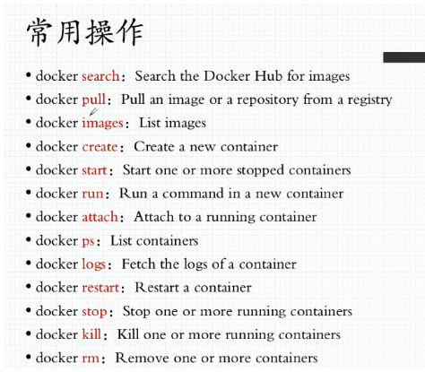
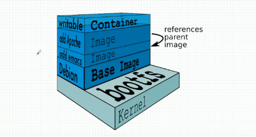

# Docker 学习3 Docker镜像管理基础

[TOC]

## docker 常用操作



## docker 镜像原理

- docker 镜像含有启动容器所需要的文件系统及其内容，因此其用于创建并启动docker 容器。
- docker 镜像采用分层构建机制，最底层为bootfs，上层为rootfs。
  - bootfs，用于系统引导的文件系统，包括bootloader和kernel,容器启动完成后会被卸载以节约内存资源。
  - rootfs，位于bootfs之上，表现为docker容器的根文件系统。
    - 传统模式中，系统启动之时，内核挂载rootfs时会首先将其挂载为只读模式，完整性自检完成后将其重新挂载为读写模式。
    - docker中，rootfs由内核挂载为只读模式，而后通过联合挂载技术额外挂载一个可写层。

- docker 镜像层
  - 位于下层的镜像称为父镜像，最底层的称为基础镜像。
  - 最上层为可读写层，其下的均为只读层。



## docker 联合挂载的专用文件系统

　　1、ubuntu 使用的联合挂载文件系统为aufs，centos使用的联合挂载文件系统为devicemapper，现在用的文件系统为overlayfs2。

　　2、aufs一开始是UnionFS，后来因为UnionFS代码太烂了才重构了aufs，不过aufs代码也很烂。

　　　　

## docker 镜像分类

1. 启动容器时，daemon会试图从本地获取相关的镜像，本地镜像不存在时，将从registry中下载该镜像并保存到本地。

2. registry用于保存docker 镜像，包括镜像的层次结构和元数据。

3. 用户可自建registry，也可以用官方的docker hub

4. 分类

   - Sponsor Registry:  第三方的Registry，供客户和Docker社区使用

   - Mirror Registry:  第三方的Registry，只让客户使用

   - Vendor Registry: 由发布Docker镜像的提供商提供的registry

   - Private Registry: 通过设有防火墙和额外的安全层的私有实体提供的registry

5. docker registry中的镜像通常由开发人员制作，而后推送至公共或私有registry上保存供其它人员使用，例如部署到生产环境。
   


## 镜像制作

- 基于容器制作镜像，docker commit 

```
[root@localhost ~]# docker ps
CONTAINER ID        IMAGE               COMMAND             CREATED             STATUS              PORTS               NAMES
97054e941ebb        d8233ab899d4        "sh"                4 minutes ago       Up 4 minutes                            b1
[root@localhost ~]# docker commit 97054e941ebb busybox:b1
sha256:cd6c0da8b93f02715e30920112aae94f6c4d64815771a03c861e258b5f2c9a52
[root@localhost ~]# docker images
REPOSITORY          TAG                 IMAGE ID            CREATED             SIZE
busybox             b1                  cd6c0da8b93f        3 seconds ago       1.2MB
busybox             latest              d8233ab899d4        5 weeks ago         1.2MB
nginx               1.14-alpine         66952fd0a8ef        7 weeks ago         16MB
centos              7                   721823ac0277        7 months ago        284MB
```
- docker commit 提交时添加作者名字和 默认启动参数

```
[root@localhost ~]# docker ps
CONTAINER ID        IMAGE               COMMAND             CREATED             STATUS              PORTS               NAMES
121c36795a1d        busybox:b1          "sh"                6 minutes ago       Up 6 minutes                            test1
97054e941ebb        d8233ab899d4        "sh"                21 minutes ago      Up 21 minutes                           b1
[root@localhost ~]# docker commit -h
Flag shorthand -h has been deprecated, please use --help

Usage:    docker commit [OPTIONS] CONTAINER [REPOSITORY[:TAG]]

Create a new image from a container's changes

Options:
  -a, --author string    Author (e.g., "John Hannibal Smith <hannibal@a-team.com>")
  -c, --change list      Apply Dockerfile instruction to the created image
  -m, --message string   Commit message
  -p, --pause            Pause container during commit (default true)
[root@localhost ~]# docker commit -a "lipingchang <1209989516@qq.com>" -m "this is a test" -c 'CMD ["/bin/httpd","-f","-h","/data/html"]' -p test1（容器名称） busybox:test1(制作的镜像名称)
sha256:f3847a399a98e54f1a3b283c06881d9adf98b663b17d92924272c251dc594c74
```
## 镜像的导入和导出

- docker save -o，将镜像打包保存为文件，可一次打包多个镜像。

```
[root@localhost ~]# docker images
REPOSITORY          TAG                 IMAGE ID            CREATED             SIZE
busybox             test1               f3847a399a98        28 minutes ago      1.2MB
busybox             b1                  cd6c0da8b93f        About an hour ago   1.2MB
busybox             latest              d8233ab899d4        5 weeks ago         1.2MB
nginx               1.14-alpine         66952fd0a8ef        7 weeks ago         16MB
centos              7                   721823ac0277        7 months ago        284MB
[root@localhost ~]# docker save -o busybox.gz busybox:test1 busybox:b1
[root@localhost ~]# ls
111.txt  anaconda-ks.cfg  busybox.gz

```
- docker load -i，将打包后的镜像文件导入

```
[root@localhost ~]# docker rmi busybox:test1 busybox:b1 
Untagged: busybox:test1
Deleted: sha256:f3847a399a98e54f1a3b283c06881d9adf98b663b17d92924272c251dc594c74
Deleted: sha256:8c8846e678a8952c6dce32aab80520b746732dda074f30843cdf0b9e89ea7cb2
Untagged: busybox:b1
Deleted: sha256:cd6c0da8b93f02715e30920112aae94f6c4d64815771a03c861e258b5f2c9a52
Deleted: sha256:1251dd6cc6ec2f2f0dbf3bef621bdb563834e99ba294b74054e6e5d5961c9536
[root@localhost ~]# docker images
REPOSITORY               TAG                 IMAGE ID            CREATED             SIZE
busybox                  latest              d8233ab899d4        5 weeks ago         1.2MB
nginx                    1.14-alpine         66952fd0a8ef        7 weeks ago         16MB
centos                   7                   721823ac0277        7 months ago        284MB
quay.io/coreos/flannel   v0.10.0-amd64       f0fad859c909        14 months ago       44.6MB
[root@localhost ~]# docker load --help 

Usage:    docker load [OPTIONS]

Load an image from a tar archive or STDIN

Options:
  -i, --input string   Read from tar archive file, instead of STDIN
  -q, --quiet          Suppress the load output    
[root@localhost ~]# docker load -i busybox.gz 
e703b81e02e8: Loading layer [==================================================>]  4.608kB/4.608kB
6321d48b6459: Loading layer [==================================================>]   2.56kB/2.56kB
Loaded image: busybox:test1
Loaded image: busybox:b1
[root@localhost ~]# docker images
REPOSITORY               TAG                 IMAGE ID            CREATED             SIZE
busybox                  test1               f3847a399a98        About an hour ago   1.2MB
busybox                  b1                  cd6c0da8b93f        About an hour ago   1.2MB
busybox                  latest              d8233ab899d4        5 weeks ago         1.2MB
nginx                    1.14-alpine         66952fd0a8ef        7 weeks ago         16MB
centos                   7                   721823ac0277        7 months ago        284MB
quay.io/coreos/flannel   v0.10.0-amd64       f0fad859c909        14 months ago       44.6MB
```
- 将容器导出为镜像文件

```
[root@localhost ~]# docker run -itd --name test1 busybox:test1 /bin/sh
075377828bfec54ff41d17d75da06e970189e1a0616a54f12fb25be12e170da2
[root@localhost ~]# docker ps
CONTAINER ID        IMAGE               COMMAND             CREATED             STATUS              PORTS               NAMES
075377828bfe        busybox:test1       "/bin/sh"           3 seconds ago       Up 2 seconds                            test1
[root@localhost ~]# docker export 075377828bfe > update.tar
[root@localhost ~]# ls
111.txt  anaconda-ks.cfg  update.tar
```
- 将容器导出的镜像文件导入为镜像

```
[root@localhost ~]# docker import - import < update.tar
sha256:5d0d74a05a0f75486c817f0efe47072ff34bfecb1f4175daf588050b2cacc6bb
[root@localhost ~]# docker images
REPOSITORY               TAG                 IMAGE ID            CREATED             SIZE
import                   latest              5d0d74a05a0f        3 seconds ago       1.2MB
busybox                  test1               f3847a399a98        About an hour ago   1.2MB
busybox                  b1                  cd6c0da8b93f        About an hour ago   1.2MB
busybox                  latest              d8233ab899d4        5 weeks ago         1.2MB
nginx                    1.14-alpine         66952fd0a8ef        7 weeks ago         16MB
centos                   7                   721823ac0277        7 months ago        284MB
quay.io/coreos/flannel   v0.10.0-amd64       f0fad859c909        14 months ago       44.6MB
```
