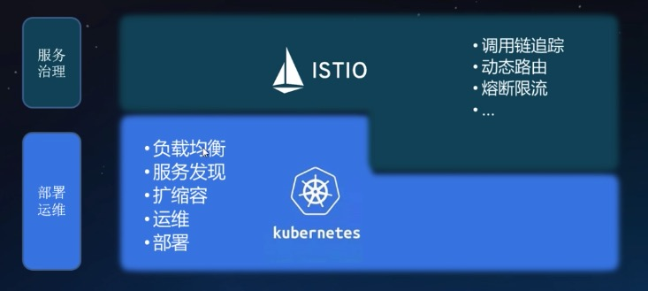
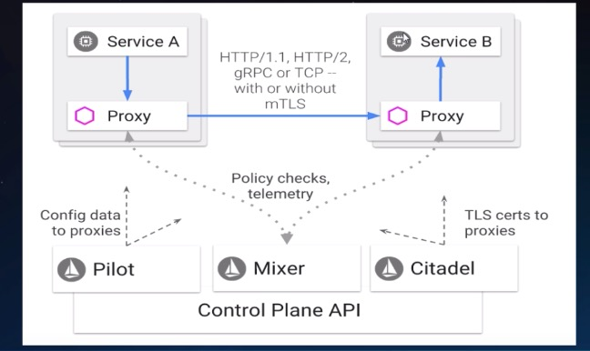

# Istio

[TOC]

## Service Mesh 是什么

[官网地址](https://istio.io/)

**Kubernetes**

- 容器编排与调度能力
- 简单的负载均衡（SVC-ipvs/iptables）

**Service Mesh**

- 服务治理
- sidecar 应用程序无感知
- 服务通信的基础设施 

**关键能力**

- 流量管理
  - 负载均衡
  - 动态路由
  - 灰度发布
  - 故障注入
- 可观察性
  - 调用链
  - 访问日志
  - 监控
- 策略执行
  - 限流
  - ACL
- 服务身份和安全
  - 认证
  - 鉴权

**扩展功能**

- 平台支持

- 集成和定制

  - ACL
  - 日志
  - 配额

  **istio 与 k8s 相互补充**

**istio架构**

**Istio & Kubernetes: 架构结合**

**Envoy**

基于C++的 L4/L7 Proxy 转发器

- Listeners
- Routes
- Clusters
- Endpoints

## Istio 基础概念

- Gateway - 外部服务的接入
- VirtualService - 版本选择
- DestinationRule - 版本内部的 反向代理策略
- ServiceEntry - 服务

## Pilot

