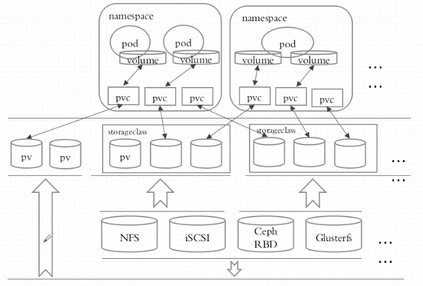

**k8s 知识点总结**

[TOC]

# kubenetes 特性

- 足鼎封装、自我修复、水平扩展、服务发现、负载均衡
- 自动发布、回滚
- 秘钥和配置管理

## RESTful

- GET PUT DELETE POST
- kubectl run get edit ...


# Kubenetes资源

## 常用资源对象

- workload: Pod, ReplicaSet, Deployment, StatefulSet, DaemonSet, Job, Cronjob 
- 负载均衡/服务发现：Service, Ingress, ...
- 配置与存储： Volume， CSI
  - cronfigMap，Secret
  - DownwardAPI
- 集群级别资源
  - Namespace， node， role， ClusterRole， RoleBinding ，  ClusterRoleBinding
- 元数据型资源
  - HPA， PodTemplate， LimitRange


## 标签labels

labels  与 资源之间是多对多的关系

标签的定义一般从以下几个角度定义

- 版本：alpha beta  canary stable
- 环境：dev pro qa
- 应用名称
- 架构层级
- 分区标签
- 品控标签

标签格式：

```
key=value  
key: 字母 数字 _ .   
value：只能以字母数字开头及结尾
```

通过标签过滤

```
kubectl get pods -l <labels>
```

查看所有标签

```
kubectl get pods --shoe-labels
```

打标签

```
 kubectl label [--overwrite] (-f FILENAME | TYPE NAME) KEY_1=VAL_1 ... KEY_N=VAL_N
[--resource-version=version] [options]
```

**标签选择器**

- 等值关系：=， ==，!=

- 集合关系：

  KEY in (VALUE1,VALUE2, ... )

  KEY not in (VALUE1,VALUE2, ... )

  !KEY  * 不存在键

**许多资源支持内嵌字段**

- matchLabels:     直接给定健值

- matchExpressions: 基于给定的表达式来定义使用标签选择器，{key:"KEY", operator: "OPERATOR", values:[VAL1, VAL2, ...]}

  操作符：In， NotIn, Exists,  NotExists

  

##创建资源的方式

apiserver仅接受JSON格式的资源定义；

yaml格式提供配置清单， apiserver可自动将其转为json格式，然后提交

**大部分的资源的配置清单，主要5个一级资源**

- apiVersion

  ```
  kubectl  api-versions 
  ```

- kind： 资源类别

- metadata: 元数据

  - name 

  - namespace
  - labels
  - annotations

  每个资源的引用PATH 路径

  /api/GROUP/VERSION/namespaces/NAMESPACE_NAME/TYPE/NAME

- spec

- status

**使用explain 查看定义**

例如：

```
kubectl explain pods.metadata
kubectl explain pods.spec.containers
```

## Pod 

k8s管理的最小单位，一个pod中可以有多个contaiers 例如

```
apiVersion: v1
kind: Pod
metadata:
  name: nginx
spec:
  containers:
  - name: nginx
    image: nginx:1.7.9
    ports:
    - containerPort: 80
    readinessProbe:
      httpGet:
        port: 80
      initialDelaySeconds: 2
      periodSeconds: 3
    livenessProbe:
      httpGet:
        port: 80
      initialDelaySeconds: 2
      periodSeconds: 3

  - name: busybox
    image: busybox:latest
    imagePullPolicy: IfNotPresent
    command: ['/bin/sh','-c','ping','www.baidu.com']
  nodeSelector:
    kubernetes.io/hostname: 192.168.0.165
```


### pods.spec.containers 必须

```
- name <string>
  image <string>
  imagePullPolicy     <string>  Always, Never, IfNotPresent. 
  * Defaults to Always if :latest tag is specified, or IfNotPresent otherwise. Cannot be updated. (优化点)
 
  ports    <[]Object> 
  * 仅仅是说明性的
  - containerPort <integer> -required-
    hostIP   0.0.0.0
    hostPort  必须与containerPort 相同，大部分不需要定义该项
    name   名称
    protocol 默认TCP
```

- 修改容器的启动命令

```
command      <[]string>
args         <[]string>

- command 会覆盖镜像中的Entrypoint 与 command
- args 会覆盖镜像中的 command
  https://kubernetes.io/docs/tasks/inject-data-application/define-command-argument-container/
```

### nodeSelector <map [string]string>

节点选择器， 限定pod运行在哪些节点上。

使用标签选择器

### nodeName<map [string]string>

直接选择节点

### annotations

注解，仅用于提供”元数据“并不提供 资源兑现选择。没有大小限制。 

### restartPolicy

Always, OnFailure, Never   Default to Always

###  hostNetwork <boolean>

Host networking requested for this pod. Use the host's network namespace.If this option is set, the ports that will be used must be specified. Default to false.

pod直接使用主机的网络名称空间。有用但不常用，默认false。


### pod的生命周期

- 串行执行多个 init_containters（初始化容器），初始化容器执行完成后退出。
- 启动主容器 main containters
  - 启动后可以执行 post start
  - 主进程执行时可以进行健康监测包括：liveness probe 与 readness probe
  - 结束前可以执行 pre stop

**状态**：

- Pending 等待调度，调度未完成

- Running 运行状态

- Failed 失败

- Succeeded

- Unknown

  等等 

**创建Pod：**

apiServer  etcd  scheduler  controller  kubelet 

**容器重启策略**：

restartPolicy


### 健康监测

健康监测主要针对容器，所以在 pod.spec.containers 层级下

**监测类型**

- livenessProbe       存活性探测

- readinessProbe     就绪性监测

- lifecycle   容器启动后 或者 停止前钩子。

  **存活并不一定就绪**

**三种探针类型**

ExecAction (exec)、TCPSocketAction (tcpSocket)、HTTPGetAction (httpGet)

**健康监测主要参数**

- exec  <Object> 使用命令监测 (重要)

  - command	<[]string>

- httpGet 

- tcpSocket

- initialDelaySeconds (重要) 初始化等待时间

- periodSeconds (重要)  检测间隔时间

- timeoutSeconds <integer> 错误超时时间 默认1秒

- failureThreshold	<integer>  最小失败次数 默认3次

- successThreshold <integer>  最小成功次数 默认1次

  

### lifecycle

容器启动后 或者 停止前钩子。

- postStart
- preStop

**注意：lifecycle的postStart执行在容器command 之后。**

FIELDS:

- exec          <Object>
- httpGet      <Object>   HTTPGet specifies the http request to perform.


### env环境变量获取

env不仅可以传递key value 的数据，还可以从其他地方传值传递。

**pods.spec.containers.env.valueFrom**

- configMapKeyRef 

  Selects a key of a ConfigMap.

  

- fieldRef     <Object>
  Selects a field of the pod: supports metadata.name, metadata.namespace, metadata.labels, metadata.annotations, spec.nodeName, spec.serviceAccountName, status.hostIP, status.podIP.

  

- resourceFieldRef     <Object>

  Selects a resource of the container: only resources limits and requests  (limits.cpu, limits.memory, limits.ephemeral-storage, requests.cpu, requests.memory and requests.ephemeral-storage) are currently supported.

  

- secretKeyRef <Object>

  Selects a key of a secret in the pod's namespace


### pod 案例

```
apiVersion: v1
kind: Pod
metadata:
  name: nginx
spec:
  containers:
  - name: nginx
    image: nginx:1.7.9
    ports:
    - containerPort: 80
    readinessProbe:
      httpGet:
        port: 80
      initialDelaySeconds: 2
      periodSeconds: 3
    livenessProbe:
      httpGet:
        port: 80
      initialDelaySeconds: 2
      periodSeconds: 3

  - name: busybox
    image: busybox:latest
    imagePullPolicy: IfNotPresent
    command: [ping, www.baidu.com]
  nodeSelector:
    kubernetes.io/hostname: 192.168.0.165
```


## Pod控制器

- ReplicaSet: 控制pod 副本数量，扩缩容机制
- Deployment：ReplicaSet的控制器， 滚动更新、回滚， 声明式定义。无状态服务
- DaemonSet:  确保每个节点执行一个
- Job : 执行一次
- CronJob : 计划任务


- StatefuleSet：有状态的服务
- CDR： Custom Defined Resources
- Operator


1. 用户应该直接操作Deployment。
2. 最好不要将有状态的服务部署在k8s上

### deployment

**更新策略**

**deployment.spec.strategy**

- Recreate
- RollingUpdate
  - maxSurge    Value can be an absolute number (ex: 5) or a percentage of desired  pods (ex: 10%).
  - maxUnavailable  Value can be an absolute number (ex: 5) or a percentage of desired pods (ex:  10%).

**deployment.spec.revisionHistoryLimit**

rc历史保存数量

**案例：**

```
apiVersion: extensions/v1beta1
kind: Deployment
metadata:
  annotations:
    author: huruizhi
    department: opreation
    usage: Java programs k8s template
  labels:
    module_name: pyfinance2v2-register-pro
    env: pro
    kind: deploy
  name: pyfinance2v2-register-pro
  namespace: default
spec:
  replicas: 4
  strategy:
    type: RollingUpdate
    rollingUpdate:    
      maxSurge: 2
      maxUnavailable: 2
  selector:
    matchLabels:
      module_name: pyfinance2v2-register-pro
      env: pro
      kind: pod
  template:
    metadata:
      creationTimestamp: null
      labels:
        module_name: pyfinance2v2-register-pro
        env: pro
        kind: pod
    spec:
      containers:
      - name: pyfinance2v2-register-pro
        image: harbor.pycf.com/pyfinance2v2/register:pro
        imagePullPolicy: Always
        ports:
        - containerPort: 5000 
        command: ['java','-jar','-Xms128m','-Xmx256m','/java8/app.jar','--server.port=5000']
        resources:
          limits:
            memory: 512Mi
          requests:
            memory: 128Mi
        env:
        - name: TZ
          value: Asia/Shanghai
        livenessProbe:
          tcpSocket:
            port: 5000
          initialDelaySeconds: 40
          periodSeconds: 3
        readinessProbe:
          tcpSocket:
            port: 5000
          initialDelaySeconds: 40
          periodSeconds: 3
          
      imagePullSecrets:
      - name: harborkey1
      restartPolicy: Always
```

### DaemSet

在每个节点上部署一个pod

支持滚动更新，支持两种更新模式。可以使用`kubectl explain daemonset.spec.updateStrategy`  查看。

手动更新 `kubectl set image daemonset abc *=nginx:1.9.1`

**案例：**

```
apiVersion: extensions/v1beta1
kind: DaemonSet
metadata:
  name: filefeat-ds
  namespace: default
  labels:
        app: filebeat
spec:
  selector:
    matchLabels:
      app: filebeat
      release: stable
  template:
    metadata:
      labels:
        app: filebeat
        release: stable
    spec:
      containers:
      - name: filefeat
        image: ikubenetes/filebeat:5.6.5-alpine
        env:
        - name: REDIS_HOST
          value: redis.default.svc.cluster.local
        - name: REDIS_LOG_LEVEL
          value: info
        
```


## Service

Service的名称解析依赖于dns 附件，网络依赖于第三方网络方案。

Service网络是一个虚拟网络，由kube-proxy维护。

工作模式：

- iptables
- ipvs

ipvs没有被激活的情况下自动使用iptables

iptables 查看：

`iptables -L -n  -t nat`

**svc.spec的重要字段**

- ClusterIP 一般不手动指定，可以指定为None 则为无头svc。

  设置成无头svc后 dns中的A记录为pod IP地址，A记录的数量与pod数量相当

  例如使用dig命令查看

  ```
  # dig pyfinance2v2-register-pro.default.svc.cluster.local. @172.20.162.187 
  
  ; <<>> DiG 9.9.4-RedHat-9.9.4-61.el7_5.1 <<>> pyfinance2v2-register-pro.default.svc.cluster.local. @172.20.162.187
  ;; global options: +cmd
  ;; Got answer:
  ;; ->>HEADER<<- opcode: QUERY, status: NOERROR, id: 3070
  ;; flags: qr aa rd ra; QUERY: 1, ANSWER: 3, AUTHORITY: 0, ADDITIONAL: 1
  
  ;; OPT PSEUDOSECTION:
  ; EDNS: version: 0, flags:; udp: 4096
  ;; QUESTION SECTION:
  ;pyfinance2v2-register-pro.default.svc.cluster.local. IN        A
  
  ;; ANSWER SECTION:
  pyfinance2v2-register-pro.default.svc.cluster.local. 5 IN A 172.20.197.37
  pyfinance2v2-register-pro.default.svc.cluster.local. 5 IN A 172.20.229.141
  pyfinance2v2-register-pro.default.svc.cluster.local. 5 IN A 172.20.41.13
  
  ;; Query time: 2 msec
  ;; SERVER: 172.20.162.187#53(172.20.162.187)
  ;; WHEN: Wed Feb 13 10:23:49 CST 2019
  ;; MSG SIZE  rcvd: 281
  ```

- ports <[]Object>

  - port
  - nodePort
  - targetPort

- selector

- type ： ExternalName（访问外部服务 例如 GlusterFs）, ClusterIP, NodePort, and LoadBalancer( 外部负载均衡 ).

- healthCheckNodePort <integer>

- sessionAffinity ：ClientIP 和 None  ，负载均衡调度策略。设置为ClientIP 则将同一个ip的连接发送到后端同一个pod上。

**域名后缀**

默认为svc_name.namespace_name.svc.cluster.local.

**案例：**

```
apiVersion: v1
kind: Service
metadata:
  annotations:
    kompose.cmd: kompose convert -f docker-compose-pro.yml
    kompose.version: 1.7.0 (HEAD)
  creationTimestamp: null
  labels:
    io.kompose.service: pyfinance2v2-amc-pro
  name: pyfinance2v2-amc-pro
  namespace: pyfinance2v2-pro
spec:
  type: NodePort
  ports:
  - name: "7562"
    port: 7562
    targetPort: 5000
    nodePort: 7562
  selector:
    io.kompose.service: pyfinance2v2-amc-pro
status:
  loadBalancer: {}
```

## Ingress Controller

外部路由引入，7层负载均衡，可以进行https 卸载。

- HAproxy （不常用）
- Nginx
- Traefik   https://docs.traefik.io/user-guide/kubernetes/
- Envoy

**案例：**

- http ingress:  https://github.com/gjmzj/kubeasz/blob/master/docs/guide/ingress.md

- https ingress:  https://github.com/gjmzj/kubeasz/blob/master/docs/guide/ingress-tls.md

```
apiVersion: extensions/v1beta1
kind: Ingress
metadata:
  name: my-nginx-ingress
  namespace: default
spec:
  rules:
  - host: my-nginx.com
    http:
      paths:
      - path: /main
        backend:
          serviceName: my-nginx
          servicePort: 80
      - path: /busybox
        backend:
          serviceName: busybox-demo
          servicePort: 80 
```

**path**: Path is an extended POSIX regex as defined by IEEE Std 1003.1, (i.e this follows the egrep/unix syntax, not the perl syntax) matched against the path of an incoming request. Currently it can contain characters disallowed from the conventional "path" part of a URL as defined by RFC 3986. Paths must begin with a '/'. If unspecified, the path defaults to a catch all  sending traffic to the backend.

例如 path 设置为 /main 则可以访问 /main /main1  等。不能访问 / 、/aaa  等其他路径下资源

## 存储卷管理

- emptyDir 临时存储目录
- hostPath  主机存储
- 网络共享存储： SAN   NAS   分布式存储（glusterfs  rbd cephfs ...）  云存储

### 支持的存储卷类型

```
kubectl explain pod.spec.volumes
kubectl explain persistentVolume.spec
```

定义一个简单的emptyDir, 包涵两个containers。两个容器公用存储卷。

```
apiVersion: v1
kind: Pod
metadata:
  name: busybox-demo
  labels:
    app: busybox
    role: volume_test
spec:
  containers:
  - name: httpd
    image: nginx:latest
    imagePullPolicy: IfNotPresent
    volumeMounts:
    - mountPath: /usr/share/nginx/html/
      name: tmp-volume
  - name: busybox
    image: busybox:latest
    imagePullPolicy: IfNotPresent
    command: ['/bin/sh','-c','while true;do echo $(date) > /data/index.html;sleep 3;done']
    volumeMounts:
    - mountPath: /data/
      name: tmp-volume
  volumes:
  - name: tmp-volume
    emptyDir:
      sizeLimit: 200M
```

### PV 与 PVC 资源



#### PV对象 及 主要参数

**PV对象不属于名称空间**

**pv.Capacity**

通过capacity给PV设置特定的大小。

**pv.accessModes**

k8s不会真正检查存储的访问模式或根据访问模式做访问限制，只是对真实存储的描述，最终的控制权在真实的存储端。目前支持三种访问模式：

\* ReadWriteOnce – PV以 read-write 挂载到一个节点

\* ReadOnlyMany – PV以read-only方式挂载到多个节点

\* ReadWriteMany – PV以read-write方式挂载到多个节点

**pv.spec.persistentVolumeReclaimPolicy**

当前支持的回收策略:

\* Retain – 允许用户手动回收

\* Recycle – 删除PV上的数据 (“rm -rf /thevolume/*”)

\* Delete – 删除PV


#### PVC对象 与重要参数

**PVC 与PV对象 关联**

**pvc.spec.accessModes**

同 pv对象

**pvc.spec.resources**

- limits
- requests

定义存储大小的需要


**案例  Glusterfs：**

```
apiVersion: v1
kind: Endpoints
metadata:
  name: gfs-endpoint
  labels:
    storage: gfs
subsets:
- addresses:
  - ip: 192.168.0.165
  ports:
  - port: 49158
    protocol: TCP
- addresses:
  - ip: 192.168.0.162
  - ip: 192.168.0.166
  ports:
  - port: 49157
    protocol: TCP
--- 
apiVersion: v1
kind: PersistentVolumeClaim
metadata:
  name: gfs-pvc
spec:
  accessModes: 
  - ReadWriteMany
  volumeName: gfs-pv
  resources:
    requests:
      storage: 20Gi
---    
apiVersion: v1
kind: PersistentVolume
metadata:
  name: gfs-pv
  labels:
    role: gfs-pv
spec:
  accessModes: 
  - ReadWriteMany
  glusterfs:  
    endpoints: gfs-endpoint
    path: gluster-test
  capacity:
    storage: 20Gi
---
apiVersion: v1
kind: PersistentVolumeClaim
metadata:
  name: gfs-pvc
spec:
  accessModes: 
  - ReadWriteMany
  volumeName: gfs-pv
  resources:
    requests:
      storage: 20Gi
---
apiVersion: v1
kind: Pod
metadata:
  name: busybox-demo
  labels:
    app: busybox
    role: volume_test
spec:
  containers:
  - name: httpd
    image: nginx:latest
    imagePullPolicy: IfNotPresent
    volumeMounts:
    - mountPath: /usr/share/nginx/html/busybox
      name: gfs-volume
  - name: busybox
    image: busybox:latest
    imagePullPolicy: IfNotPresent
    command: ['/bin/sh','-c','while true;do echo $(date) >> /data/index.html;sleep 3;done']
    volumeMounts:
    - mountPath: /data/
      name: gfs-volume
  volumes:
  - name: gfs-volume
    persistentVolumeClaim:
      claimName: gfs-pvc
```


### StorageClass 动态生成pv

### 容器配置管理 secret 与 configmap

可以使用环境变量以及 挂载的方式配置到pod当中。

**注意：环境变量的方式只能在容器启动的时候注入，更新configmap 不会更新容器中环境变量的值。使用挂载的方式可以实时更新。**

创建configMap 有多种方式

- 使用kubectl create命令行方式

```
  # Create a new configmap named my-config based on folder bar
  kubectl create configmap my-config --from-file=path/to/bar
  
  # Create a new configmap named my-config with specified keys instead of file basenames on disk
  kubectl create configmap my-config --from-file=key1=/path/to/bar/file1.txt --from-file=key2=/path/to/bar/file2.txt
  
  # Create a new configmap named my-config with key1=config1 and key2=config2
  kubectl create configmap my-config --from-literal=key1=config1 --from-literal=key2=config2
  
  # Create a new configmap named my-config from the key=value pairs in the file
  kubectl create configmap my-config --from-file=path/to/bar
  
  # Create a new configmap named my-config from an env file
  kubectl create configmap my-config --from-env-file=path/to/bar.env
```

- 使用yaml文件

```
apiVersion: v1
kind: ConfigMap
metadata:
  name: test-cfg
  namespace: default
data:
  cache_host: memcached-gcxt
  cache_port: "11211"
  cache_prefix: gcxt
  my.cnf: |
    [mysqld]
    log-bin = mysql-bin
  app.properties: |
    property.1 = value-1
    property.2 = value-2
    property.3 = value-3
```

使用命令行创建更灵活。

**可以使用inotify监控配置文件实现重载**

例如:

```
#!/bin/sh
oldcksum=`cksum /etc/nginx/conf.d/default.conf`

inotifywait -e modify,move,create,delete -mr --timefmt '%d/%m/%y %H:%M' --format '%T' \
/etc/nginx/conf.d/ | while read date time; do

    newcksum=`cksum /etc/nginx/conf.d/default.conf`
    if [ "$newcksum" != "$oldcksum" ]; then
        echo "At ${time} on ${date}, config file update detected."
        oldcksum=$newcksum
        nginx -s reload
    fi

done
```

关于configmap的详细总结： https://www.cnblogs.com/breezey/p/6582082.html


## StatefuleSet

**特点：**

1. 稳定且唯一的网络标识符；
2. 稳定且持久的存储；
3. 有序、平滑的部署和扩展；
4. 有序、平滑的删除和终止；
5. 有序的滚动更新；

**三个主要组件：**headless service 、 StatefulSet、 volumeClaimTemplate

名称解析：

pod_name,service_name.ns_name.svc.cluster.local


**更新策略**

sts.spec.updateStrategy.rollingUpdate

- partition  定义更新的边界，例如 定义为3 则编号 >=3的 pod会更新，模拟金丝雀发布

**PV定义**

```
apiVersion: v1
kind: Endpoints
metadata:
  name: gfs-endpoint
  labels:
    storage: gfs
subsets:
- addresses:
  - ip: 192.168.0.165
  ports:
  - port: 49158
    protocol: TCP
- addresses:
  - ip: 192.168.0.162
  - ip: 192.168.0.166
  ports:
  - port: 49157
    protocol: TCP

---

apiVersion: v1
kind: PersistentVolume
metadata:
  name: gfs-pv-01
  labels:
    role: gfs-pv-01
spec:
  accessModes: 
  - ReadWriteMany
  - ReadWriteOnce
  glusterfs:  
    endpoints: gfs-endpoint
    path: pv-01
  capacity:
    storage: 5Gi
---
apiVersion: v1
kind: PersistentVolume
metadata:
  name: gfs-pv-02
  labels:
    role: gfs-pv-02
spec:
  accessModes:
  - ReadWriteMany
  - ReadWriteOnce
  glusterfs:
    endpoints: gfs-endpoint
    path: pv-02
  capacity:
    storage: 5Gi
---
apiVersion: v1
kind: PersistentVolume
metadata:
  name: gfs-pv-03
  labels:
    role: gfs-pv-03
spec:
  accessModes:
  - ReadWriteMany
  - ReadWriteOnce
  glusterfs:
    endpoints: gfs-endpoint
    path: pv-03
  capacity:
    storage: 5Gi
--- 
apiVersion: v1
kind: PersistentVolume
metadata:
  name: gfs-pv-04
  labels:
    role: gfs-pv-04
spec:
  accessModes:
  - ReadWriteMany
  - ReadWriteOnce
  glusterfs:
    endpoints: gfs-endpoint
    path: pv-04
  capacity:
    storage: 5Gi
---
apiVersion: v1
kind: PersistentVolume
metadata:
  name: gfs-pv-05
  labels:
    role: gfs-pv-05
spec:
  accessModes:
  - ReadWriteMany
  - ReadWriteOnce
  glusterfs:
    endpoints: gfs-endpoint
    path: pv-05
  capacity:
    storage: 5Gi
```

**StatefulSet定义**

```
apiVersion: v1
kind: Service
metadata:
  name: myapp-svc
  labels:
    roles: myapp-svc-test
spec:
  clusterIP: None
  ports:
  - targetPort: 80
    port: 80
  selector:
    roles: myapp-pod
---
apiVersion: apps/v1
kind: StatefulSet
metadata:
  name: myapp-sts
  labels:
    roles: myapp-sts-test
spec:
  replicas: 3
  serviceName: myapp-svc
  selector: 
    matchLabels:
      roles: myapp-pod
  template:
    metadata:
      labels:
        roles: myapp-pod
    spec:
      containers:
       - name: httpd
         image: nginx:latest
         imagePullPolicy: IfNotPresent
         volumeMounts:
         - mountPath: /usr/share/nginx/html/busybox
           name: gfs-volume
  volumeClaimTemplates:
  - metadata:
      name: gfs-volume
    spec:
      accessModes: [ "ReadWriteOnce" ]
      resources:
        requests:
          storage: 5Gi
  updateStrategy:
    rollingUpdate: 
      partition: 2
```

 

# k8s认证

**主要使用 RBAC授权检查机制**
**认证：**  token  ssl(双向认证\加密会话) 
**授权检查**
**准入控制**

## 客户端 --->  API Server
API Server 对用户权限的判断需要以下：
user： username uid
group：
extra：

- 开启api代理
```
kubectl proxy
```
HTTP request verb
  get  post  put delte
API request verb
  get list create update  path watch(- w) proxy redirect deletecollection
Resource:
Subresource
namespace
Api group

## 

## RBCA

kubeconfig 配置kubectl 连入apiServer的配置

```
# kubectl config view 
apiVersion: v1
clusters:
- cluster:
    certificate-authority-data: REDACTED
    server: https://192.168.0.200:8443
  name: kubernetes
contexts:
- context:
    cluster: kubernetes
    user: admin
  name: kubernetes
current-context: kubernetes
kind: Config
preferences: {}
users:
- name: admin
  user:
    client-certificate-data: REDACTED
    client-key-data: REDACTED
```

一个客户端可以配置连接多个集群

context用于定义账号与集群的关系，current-context定义当前访问的集群。


