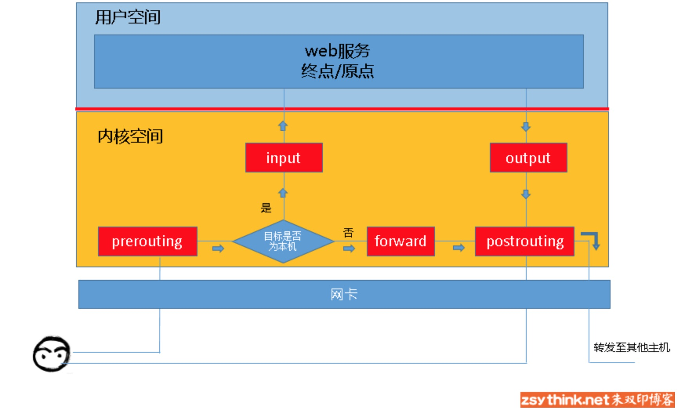
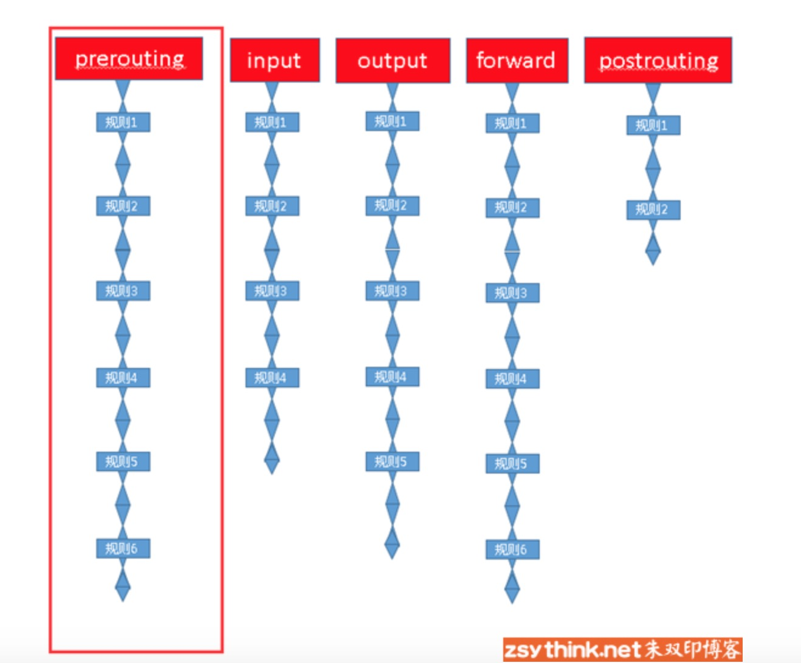
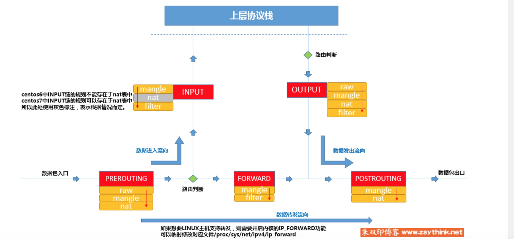
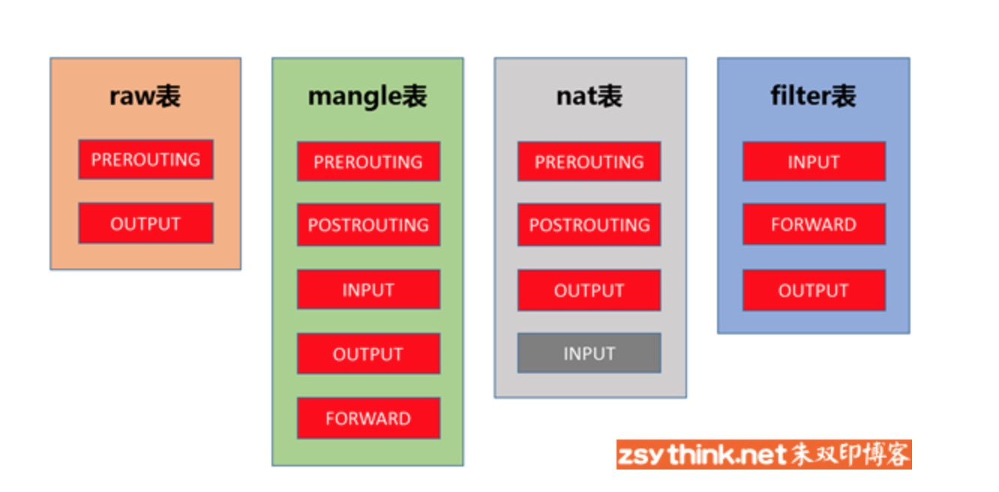

## iptables

### 1. iptables 是什么

iptables 是一个**客户端**，用户通过ipatbales这个代理，将用户的安全设定执行到对应的“安全框架中”， 这个安全框架才是真正的防火墙，框架的名字叫**netfilter**。

iptables 处于用户空间，netfiler 在内核空间。

netfilter的功能如下：

1.网络地址转换

2.数据包内容修改

3.数据库包过滤

### 2.iptables 基础

iptables 根据规则来处理包，规则包括：

1. 源地址
2. 目的地址
3. 协议类型（tcp udp icmp）
4. 服务类型、端口号（http ftp）

当规则与规则匹配的时候就根据定义的方法进行处理，比如 accept  reject  drop

#### 2.1链的概念

当数据库包到达服务器的时候并不是直接到达用户空间，而是需要在内核空间对包进行分析。根据包的不同目的地，会经过不同的路径，这个路径就是链。



根据图我们可以看到常见的数据流向：

进入到本服务器：prerouting -> input

本机转发： outroute -> postrouting

经由本机的转发: pretouting -> forward -> postrouting


由于每个链上的规则不止一个，而当包经过的时候，会对每一个规则进行依次的匹配，像一个链条一样，所以被称为“链”



#### 2.2 表的概念

我们在每个链表上都配置的很多的规则，这些规则有些很相似，都是完成某一些功能。我们把相同功能的集合叫做“表”。

iptables 定义的四种表

filter：负责过滤功能；内核模块iptables_filter

nat： 负责网络地址转换；内核模块iptbales_nat

mangle: 拆解报文，做出修改，并重新封装；iptables_mangle

raw：关闭nat表上启用的连接追踪机制。iptables_raw

### 3.表链的关系

#### 3.1  表优先级

raw -> mangle -> nat -> filter

> raw表优先处理，可以跳过nat 和 ip_conntrack处理， 既不再进行地址转换和链接跟踪处理了。 nat 需要 mangle 先对 报文进行修改后， 在进行地址转换规则的判断。filter 需要在最后对报文进行拦截。

#### 3.2   链->表的对应关系

prerouting:  	raw mangle nat

input ：		    mangle nat(centos7) filter

output:			 raw mangle nat filter

postrouting:     mangle  filter



#### 3.2   表->链的对应关系

raw 表：prerouting output （两个进入内核区的入口）

mangle表:  prerouting input forward output  postrouting （所有都有）

nat表 ：prerouting input  output  postrouting  （forward 没有）

filter表： input forward output （三个中间过程）



### 4. 规则

#### 1 匹配条件

- 基础匹配条件： 源IP， 目的IP
- 扩展条件： 源端口，目的端口

#### 2. 处理动作

- ACCEPT
- DROP
- REJECT
- SNAT
- MASQUERADE：特殊的SNAT 适用于动态的 临时会变的ip上
- DNAT
- REDIRECT： 本机端口映射
-  LOG：记录日志不做任何的操作

### 5. 命令总结

#### 查询命令

```
iptables -t 表名 -L

iptables -t 表名 -L 链名

iptables -t 表名 -v -L

iptables -t 表名 -n -L

iptables --line -t 表名 -L
查看行号

常用查看命令
iptables -t 表名 -nvL 链名 --line


```

#### 添加命令

```
iptables  -t filter -A INPUT -s 192.168.1.146 -j DROP
在filter 表的 INPUT 链的 最后 插入规则

iptables  -t filter -I INPUT -s 192.168.1.146 -j ACCEPT
在filter 表的 INPUT 链的 最开始 插入规则

iptables -t filter -I INPUT 6 -s 192.168.1.146 -j REJECT
在指定的位置添加规则

iptables -t filter -P FORWARD ACCEPT
将filter表中 FORWARD 链默认策略设置为ACCEPT

```

#### 删除规则

```
iptables -t filter -D INPUT 3
删除 filter 表中INPUT 链中的3 号规则
```

#### 修改策略

```
iptables -t filter -R INPUT 3 -s 192.168.1.146 -j ACCEPT
将  filter 表中INPUT 链中的3 号规则修改为accept ，192.168.1.146 为原规则的内容，如果不加忽略这条配置肯能会将 源地址改为0.0.0.0
```

#### 保存与恢复

```
iptables-save > /etc/sysconfig/iptables
iptables-restore < /etc/sysconfig/iptables
```

### 6. 基本条件总结

-s 用于匹配源地址 可以同时指定多个源地址，或者指定网段。

```
#示例如下
iptables -t filter -I INPUT -s 192.168.1.111,192.168.1.118 -j DROP
iptables -t filter -I INPUT -s 192.168.1.0/24 -j ACCEPT
iptables -t filter -I INPUT ! -s 192.168.1.0/24 -j ACCEPT
```

-d 用于匹配目的地址 可以同时指定多个目的地址，或者指定网段。

```
#示例如下
iptables -t filter -I OUTPUT -d 192.168.1.111,192.168.1.118 -j DROP
iptables -t filter -I INPUT -d 192.168.1.0/24 -j ACCEPT
iptables -t filter -I INPUT ! -d 192.168.1.0/24 -j ACCEPT
```

-p 用于指定协议类型 ,比如 tcp udp icmp icpmv6 esp ah 等。

```
#示例如下
iptables -t filter -I INPUT -p tcp -s 192.168.1.146 -j ACCEPT
iptables -t filter -I INPUT ! -p udp -s 192.168.1.146 -j ACCEPT
```

-i 用于匹配报文是从哪个网卡流入本机的， 由于匹配条件只是用于匹配报文流入，所以output 与postrouting 不适用于此选项

```
#示例如下
iptables -t filter -I INPUT -p icmp -i eth4 -j DROP
iptables -t filter -I INPUT -p icmp ! -i eth4 -j DROP
```

-o 用于匹配报文是从哪个网卡流出本机的， 由于匹配条件只是用于匹配报文流入，所以input 与prerouting 不适用于此选项

```
#示例如下
iptables -t filter -I OUTPUT -p icmp -o eth4 -j DROP
iptables -t filter -I OUTPUT -p icmp ! -o eth4 -j DROP
```

### 7. 常用扩展模块总结

#### 7.1 tcp 扩展

```
#示例如下
iptables -t filter -I OUTPUT -d 192.168.1.146 -p tcp -m tcp --sport 22 -j REJECT
iptables -t filter -I INPUT -s 192.168.1.146 -p tcp -m tcp --dport 22:25 -j REJECT
iptables -t filter -I INPUT -s 192.168.1.146 -p tcp -m tcp --dport :22 -j REJECT
iptables -t filter -I INPUT -s 192.168.1.146 -p tcp -m tcp --dport 80: -j REJECT
iptables -t filter -I OUTPUT -d 192.168.1.146 -p tcp -m tcp ! --sport 22 -j ACCEPT
```

#### 7.2 multiport

```
#示例如下
iptables -t filter -I OUTPUT -d 192.168.1.146 -p udp -m multiport --sports 137,138 -j REJECT
iptables -t filter -I INPUT -s 192.168.1.146 -p tcp -m multiport --dports 22,80 -j REJECT
iptables -t filter -I INPUT -s 192.168.1.146 -p tcp -m multiport ! --dports 22,80 -j REJECT
iptables -t filter -I INPUT -s 192.168.1.146 -p tcp -m multiport --dports 80:88 -j REJECT
iptables -t filter -I INPUT -s 192.168.1.146 -p tcp -m multiport --dports 22,80:88 -j REJECT
```

#### 7.3  iprange

```
#示例
iptables -t filter -I INPUT -m iprange --src-range 192.168.1.127-192.168.1.146 -j DROP
iptables -t filter -I OUTPUT -m iprange --dst-range 192.168.1.127-192.168.1.146 -j DROP
iptables -t filter -I INPUT -m iprange ! --src-range 192.168.1.127-192.168.1.146 -j DROP
```


