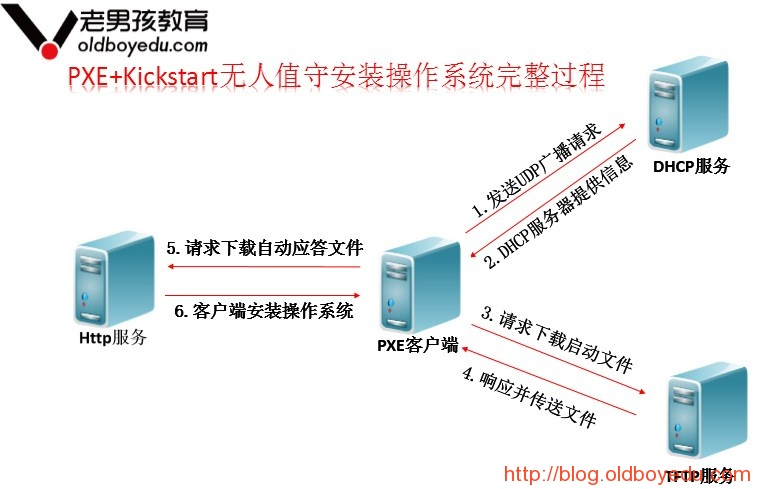
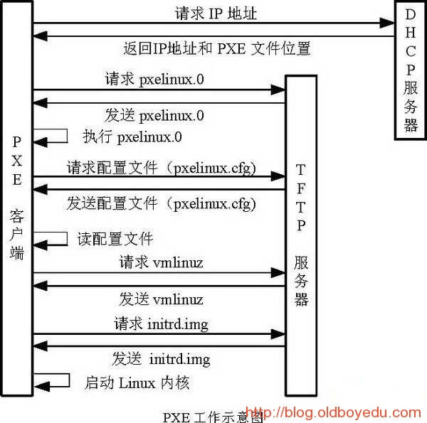

## COBBLER无人值守安装

[原文地址 kickstart](https://blog.oldboyedu.com/autoinstall-kickstart/)

[原文地址 cobbler](https://blog.oldboyedu.com/autoinstall-cobbler/)

[TOC]

## 0. 简介

### 0.1 什么是PXE

- PXE，全名Pre-boot Execution Environment，预启动执行环境；
- 通过网络接口启动计算机，不依赖本地存储设备（如硬盘）或本地已安装的操作系统；
- 由Intel和Systemsoft公司于1999年9月20日公布的技术；
- Client/Server的工作模式；
- PXE客户端会调用网际协议(IP)、用户数据报协议(UDP)、动态主机设定协议(DHCP)、小型文件传输协议(TFTP)等网络协议；
- PXE客户端(client)这个术语是指机器在PXE启动过程中的角色。一个PXE客户端可以是一台服务器、笔记本电脑或者其他装有PXE启动代码的机器（我们电脑的网卡）。

### 0.2 PXE的工作过程





1. PXE Client向DHCP发送请求 
   PXE Client从自己的PXE网卡启动，通过PXE BootROM(自启动芯片)会以UDP(简单用户数据报协议)发送一个广播请求，向本网络中的DHCP服务器索取IP。

2. DHCP服务器提供信息 
   DHCP服务器收到客户端的请求，验证是否来至合法的PXE Client的请求，验证通过它将给客户端一个“提供”响应，这个“提供”响应中包含了为客户端分配的IP地址、pxelinux启动程序(TFTP)位置，以及配置文件所在位置。

3. PXE客户端请求下载启动文件 
   客户端收到服务器的“回应”后，会回应一个帧，以请求传送启动所需文件。这些启动文件包括：pxelinux.0、pxelinux.cfg/default、vmlinuz、initrd.img等文件。

4. Boot Server响应客户端请求并传送文件 
   当服务器收到客户端的请求后，他们之间之后将有更多的信息在客户端与服务器之间作应答, 用以决定启动参数。BootROM由TFTP通讯协议从Boot Server下载启动安装程序所必须的文件(pxelinux.0、pxelinux.cfg/default)。default文件下载完成后，会根据该文件中定义的引导顺序，启动Linux安装程序的引导内核。

5. 请求下载自动应答文件 
   客户端通过pxelinux.cfg/default文件成功的引导Linux安装内核后，安装程序首先必须确定你通过什么安装介质来安装linux，如果是通过网络安装(NFS, FTP, HTTP)，则会在这个时候初始化网络，并定位安装源位置。接着会读取default文件中指定的自动应答文件ks.cfg所在位置，根据该位置请求下载该文件。

   > 这里有个问题，在第2步和第5步初始化2次网络了，这是由于PXE获取的是安装用的内核以及安装程序等，而安装程序要获取的是安装系统所需的二进制包以及配置文件。因此PXE模块和安装程序是相对独立的，PXE的网络配置并不能传递给安装程序，从而进行两次获取IP地址过程，但IP地址在DHCP的租期内是一样的。

6. 客户端安装操作系统 
   将ks.cfg文件下载回来后，通过该文件找到OS Server，并按照该文件的配置请求下载安装过程需要的软件包。 
   OS Server和客户端建立连接后，将开始传输软件包，客户端将开始安装操作系统。安装完成后，将提示重新引导计算机。

## 1. Cobbler介绍

Cobbler是一个Linux服务器安装的服务，可以通过网络启动(PXE)的方式来快速安装、重装物理服务器和虚拟机，同时还可以管理DHCP，DNS等。

Cobbler可以使用命令行方式管理，也提供了基于Web的界面管理工具(cobbler-web)，还提供了API接口，可以方便二次开发使用。

Cobbler是较早前的kickstart的升级版，优点是比较容易配置，还自带web界面比较易于管理。

Cobbler内置了一个轻量级配置管理系统，但它也支持和其它配置管理系统集成，如Puppet，暂时不支持SaltStack。

[Cobbler官网](http://cobbler.github.io/)

### 1.1 Cobbler集成的服务

- PXE服务支持
- DHCP服务管理
- DNS服务管理(可选bind,dnsmasq)
- 电源管理
- Kickstart服务支持
- YUM仓库管理
- TFTP(PXE启动时需要)
- Apache(提供kickstart的安装源，并提供定制化的kickstart配置)

### 1.2 系统环境准备

- 操作系统版本
```shell
# cat /etc/redhat-releaseCentOS
release 6.7 (Final)
```

- 内核版本
```shell
# uname -r
2.6.32-573.el6.x86_64
```

- selinux与防火墙 配置
```shell
# getenforce
Disabled
# /etc/init.d/iptables status
iptables: Firewall is not running.
```

- 配置阿里云的epel源
```shell
wget -O /etc/yum.repos.d/epel.repo http://mirrors.aliyun.com/repo/epel-6.repo
```

## 2. Cobbler安装配置

### 2.1 安装Cobbler

```shell
yum -y install cobbler cobbler-web dhcp tftp-server tftp pykickstart httpd
rpm -ql cobbler  # 查看安装的文件，下面列出部分。
/etc/cobbler                  # 配置文件目录
/etc/cobbler/settings         # cobbler主配置文件，这个文件是YAML格式，Cobbler是python写的程序。
/etc/cobbler/dhcp.template    # DHCP服务的配置模板
/etc/cobbler/tftpd.template   # tftp服务的配置模板
/etc/cobbler/rsync.template   # rsync服务的配置模板
/etc/cobbler/iso              # iso模板配置文件目录
/etc/cobbler/pxe              # pxe模板文件目录
/etc/cobbler/power            # 电源的配置文件目录
/etc/cobbler/users.conf       # Web服务授权配置文件
/etc/cobbler/users.digest     # 用于web访问的用户名密码配置文件
/etc/cobbler/dnsmasq.template # DNS服务的配置模板
/etc/cobbler/modules.conf     # Cobbler模块配置文件
/var/lib/cobbler              # Cobbler数据目录
/var/lib/cobbler/config       # 配置文件
/var/lib/cobbler/kickstarts   # 默认存放kickstart文件
/var/lib/cobbler/loaders      # 存放的各种引导程序
/var/www/cobbler              # 系统安装镜像目录
/var/www/cobbler/ks_mirror    # 导入的系统镜像列表
/var/www/cobbler/images       # 导入的系统镜像启动文件
/var/www/cobbler/repo_mirror  # yum源存储目录
/var/log/cobbler              # 日志目录
/var/log/cobbler/install.log  # 客户端系统安装日志
/var/log/cobbler/cobbler.log  # cobbler日志
```

### 2.2 配置Cobbler
- 启动apache
```
/etc/init.d/httpd restart
停止 httpd：                                               [失败]
正在启动 httpd：                                           [确定]
```

- 配置cobbler
```
/etc/init.d/cobblerd startStarting cobbler daemon:      [确定]
cobbler check  # 检查Cobbler的配置，如果看不到下面的结果，再次执行

/etc/init.d/cobblerd restartThe following are potential configuration items that you may want to fix:
1 : The 'server' field in /etc/cobbler/settings must be set to something other than localhost, or kickstarting features will not work.  This should be a resolvable hostname or IP for the boot server as reachable by all machines that will use it.
2 : For PXE to be functional, the 'next_server' field in /etc/cobbler/settings must be set to something other than 127.0.0.1, and should match the IP of the boot server on the PXE network.
3 : some network boot-loaders are missing from /var/lib/cobbler/loaders, you may run 'cobbler get-loaders' to download them, or, if you only want to handle x86/x86_64 netbooting, you may ensure that you have installed a *recent* version of the syslinux package installed and can ignore this message entirely.  Files in this directory, should you want to support all architectures, should include pxelinux.0, menu.c32, elilo.efi, and yaboot. The 'cobbler get-loaders' command is the easiest way to resolve these requirements.
4 : change 'disable' to 'no' in /etc/xinetd.d/rsync
5 : debmirror package is not installed, it will be required to manage debian deployments and repositories
6 : The default password used by the sample templates for newly installed machines (default_password_crypted in /etc/cobbler/settings) is still set to 'cobbler' and should be changed, try: "openssl passwd -1 -salt 'random-phrase-here' 'your-password-here'" to generate new one
7 : fencing tools were not found, and are required to use the (optional) power management features. install cman or fence-agents to use themRestart cobblerd and then run 'cobbler sync' to apply changes.
```

看着上面的结果，一个一个解决。
第1、2、6个问题，顺便修改其他功能

```
cp /etc/cobbler/settings{,.ori}  # 备份# server，Cobbler服务器的IP。

sed -i 's/server: 127.0.0.1/server: 192.168.0.15/' /etc/cobbler/settings
```
next_server，如果用Cobbler管理DHCP，修改本项，作用不解释，看kickstart。
```
sed -i 's/next_server: 127.0.0.1/next_server: 192.668.0.15/' /etc/cobbler/settings
```
**重要：用Cobbler管理DHCP**

```
sed -i 's/manage_dhcp: 0/manage_dhcp: 1/' /etc/cobbler/settings
```
防止循环装系统，适用于服务器第一启动项是PXE启动。
```
sed -i 's/pxe_just_once: 0/pxe_just_once: 1/' /etc/cobbler/settings
```
设置新装系统的默认root密码123456。下面的命令来源于提示6。random-phrase-here为干扰码，可以自行设定。
```
openssl passwd -1 -salt 'oldboy' '123456'
$1$oldboy$Npg9Pt9k98Mlg0ZeqHAuN1

vim /etc/cobbler/settings 
default_password_crypted: "$1$oldboy$Npg9Pt9k98Mlg0ZeqHAuN1"
```
第3个问题
```
cobbler get-loaders  # 会自动从官网下载
```
第4个问题
```
vim /etc/xinetd.d/rsyncdisable = no
```
重启服务并进行检查
```
/etc/init.d/xinetd restart
停止 xinetd：                                              [确定]
正在启动 xinetd：                                           [确定]
/etc/init.d/cobblerd restart
Stopping cobbler daemon:                                   [确定]
Starting cobbler daemon:                                   [确定]

cobbler check
The following are potential configuration items that you may want to fix:
1 : debmirror package is not installed, it will be required to manage debian deployments and repositories  # 和debian系统相关，不需要
2 : fencing tools were not found, and are required to use the (optional) power management features. install cman or fence-agents to use them
# fence设备相关，不需要
Restart cobblerd and then run 'cobbler sync' to apply changes.
```

### 2.3 配置DHCP
修改cobbler的dhcp模版，不要直接修改dhcp本身的配置文件，因为cobbler会覆盖。
vim /etc/cobbler/dhcp.template    
仅列出修改过的字段
```
 subnet 10.0.0.0 netmask 255.255.255.0 {
	option routers             10.0.0.2;
    option domain-name-servers 10.0.0.2;
    option subnet-mask         255.255.255.0;
    range dynamic-bootp        10.0.0.100 10.0.0.200;
    ……
```

### 2.4 同步cobbler配置
同步最新cobbler配置，它会根据配置自动修改dhcp等服务。
```
cobbler sync   # 同步所有配置，可以仔细看一下sync做了什么。
task started: 2015-12-03_204822_sync
task started (id=Sync, time=Thu Dec  3 20:48:22 2015)
running pre-sync triggers
cleaning trees
removing: /var/lib/tftpboot/pxelinux.cfg/default
removing: /var/lib/tftpboot/grub/images
copying bootloaders
trying hardlink /var/lib/cobbler/loaders/pxelinux.0 -> /var/lib/tftpboot/pxelinux.0
copying: /var/lib/cobbler/loaders/pxelinux.0 -> /var/lib/tftpboot/pxelinux.0
trying hardlink /var/lib/cobbler/loaders/menu.c32 -> /var/lib/tftpboot/menu.c32
trying hardlink /var/lib/cobbler/loaders/yaboot -> /var/lib/tftpboot/yaboot
trying hardlink /usr/share/syslinux/memdisk -> /var/lib/tftpboot/memdisk
trying hardlink /var/lib/cobbler/loaders/grub-x86.efi -> /var/lib/tftpboot/grub/grub-x86.efi
trying hardlink /var/lib/cobbler/loaders/grub-x86_64.efi -> /var/lib/tftpboot/grub/grub-x86_64.efi
copying distros to tftpboot
copying images
generating PXE configuration files
generating PXE menu structure
rendering DHCP files
generating /etc/dhcp/dhcpd.conf
rendering TFTPD files
generating /etc/xinetd.d/tftp
cleaning link caches
running post-sync triggers
running python triggers from /var/lib/cobbler/triggers/sync/post/*
running python trigger cobbler.modules.sync_post_restart_services
running: dhcpd -t -q
received on stdout: 
received on stderr: 
running: service dhcpd restart
received on stdout: 关闭 dhcpd：[确定]
正在启动 dhcpd：[确定]
received on stderr: 
running shell triggers from /var/lib/cobbler/triggers/sync/post/*
running python triggers from /var/lib/cobbler/triggers/change/*
running python trigger cobbler.modules.scm_track
running shell triggers from /var/lib/cobbler/triggers/change/*
*** TASK COMPLETE ***
```

### 2.5 开机启动

```
cat >>/etc/init.d/cobbler<<EOF
#!/bin/bash
# chkconfig: 345 80 90
# description:cobbler
case \$1 in
  start)
    /etc/init.d/httpd start
    /etc/init.d/xinetd start
    /etc/init.d/dhcpd start
    /etc/init.d/cobblerd start
    ;;
  stop)
    /etc/init.d/httpd stop
    /etc/init.d/xinetd stop
    /etc/init.d/dhcpd stop
    /etc/init.d/cobblerd stop
    ;;
  restart)
    /etc/init.d/httpd restart
    /etc/init.d/xinetd restart
    /etc/init.d/dhcpd restart
    /etc/init.d/cobblerd restart
    ;;
  status)
    /etc/init.d/httpd status
    /etc/init.d/xinetd status
    /etc/init.d/dhcpd status
    /etc/init.d/cobblerd status
    ;;
  sync)
    cobbler sync
    ;;
  *)
    echo "Input error,please in put 'start|stop|restart|status|sync'!"
    exit 2
    ;;
esac
EOF
# chmod +x /etc/init.d/cobbler
# chkconfig cobbler on
```

## 3. Cobbler的命令行管理

### 3.1 查看命令帮助

```
# cobbler
usage
=====
cobbler <distro|profile|system|repo|image|mgmtclass|package|file> ... 
        [add|edit|copy|getks*|list|remove|rename|report] [options|--help]
cobbler <aclsetup|buildiso|import|list|replicate|report|reposync|sync|validateks|version|signature|get-loaders|hardlink> [options|--help]
[root@linux-node1 ~]# cobbler import --help  # 导入镜像
Usage: cobbler [options]
Options:
  -h, --help            show this help message and exit
  --arch=ARCH           OS architecture being imported
  --breed=BREED         the breed being imported
  --os-version=OS_VERSION
                        the version being imported
  --path=PATH           local path or rsync location
  --name=NAME           name, ex 'RHEL-5'
  --available-as=AVAILABLE_AS
                        tree is here, don't mirror
  --kickstart=KICKSTART_FILE
                        assign this kickstart file
  --rsync-flags=RSYNC_FLAGS
                        pass additional flags to rsync
cobbler check    核对当前设置是否有问题
cobbler list     列出所有的cobbler元素
cobbler report   列出元素的详细信息
cobbler sync     同步配置到数据目录,更改配置最好都要执行下
cobbler reposync 同步yum仓库
cobbler distro   查看导入的发行版系统信息
cobbler system   查看添加的系统信息
cobbler profile  查看配置信息
```

### 3.2 导入镜像

```
# mount /dev/cdrom /mnt/  # 挂载CentOS7的系统镜像。
# 导入系统镜像
# cobbler import --path=/mnt/ --name=CentOS-7.5-x86_64 --arch=x86_64
```
参数:
 --path 镜像路径
 --name 为安装源定义一个名字
 --arch 指定安装源是32位、64位、ia64, 目前支持的选项有: x86│x86_64│ia64
**注意：**安装源的唯一标示就是根据name参数来定义，本例导入成功后，安装源的唯一标示就是：CentOS-7.5-x86_64，如果重复，系统会提示导入失败。
```
# cobbler distro list  # 查看镜像列表
   CentOS-7.5-x86_64
```

镜像存放目录，cobbler会将镜像中的所有安装文件拷贝到本地一份，放在/var/www/cobbler/ks_mirror下的CentOS-7.5-x86_64目录下。因此/var/www/cobbler目录必须具有足够容纳安装文件的空间。
```bash
# cd /var/www/cobbler/ks_mirror/
# ls
CentOS-7.5-x86_64  config
# ls CentOS-7.5-x86_64/
CentOS_BuildTag  GPL       LiveOS    RPM-GPG-KEY-CentOS-7
EFI              images    Packages  RPM-GPG-KEY-CentOS-Testing-7
EULA             isolinux  repodata  TRANS.TBL
```

检查软连接

```bash
# cd /var/www/cobbler/links/
# ll
总用量 0
lrwxrwxrwx 1 root root 44 11月 27 10:14 CentOS-7.5-x86_64 -> /var/www/cobbler/ks_mirror/CentOS-7.5-x86_64
```


### 3.3 指定ks.cfg文件及调整内核参数

- 上传cfg文件
```shell
# cd /var/lib/cobbler/kickstarts/
# ls  # 自带很多
default.ks    install_profiles  sample_autoyast.xml  sample_esxi4.ks  sample_old.seed
esxi4-ks.cfg  legacy.ks         sample_end.ks（默认使用的ks文件）        sample_esxi5.ks  sample.seed
esxi5-ks.cfg  pxerescue.ks      sample_esx4.ks       sample.ks
# rz  # 上传准备好的ks文件
rz waiting to receive.
Starting zmodem transfer.  Press Ctrl+C to cancel.
Transferring Cobbler-CentOS-7.5-x86_64.cfg...
  100%       1 KB       1 KB/sec    00:00:01       0 Errors
# mv Cobbler-CentOS-7.5-x86_64.cfg CentOS-7.5-x86_64.cfg
```
在第一次导入系统镜像后，Cobbler会给镜像指定一个默认的kickstart自动安装文件在/var/lib/cobbler/kickstarts下的sample_end.ks。
```shell
# cobbler list
distros:
   CentOS-7.5-x86_64
profiles:
   CentOS-7.5-x86_64
systems:
repos:
images:
mgmtclasses:
packages:
files:
```

- 查看安装镜像文件信息
``` shell
[root@linux-node1 ~]# cobbler distro report --name=CentOS-7.5-x86_64
Name                           : CentOS-7.5-x86_64
Architecture                   : x86_64
TFTP Boot Files                : {}
Breed                          : redhat
Comment                        : 
Fetchable Files                : {}
Initrd                         : /var/www/cobbler/ks_mirror/CentOS-7.5-x86_64/images/pxeboot/initrd.img
Kernel                         : /var/www/cobbler/ks_mirror/CentOS-7.5-x86_64/images/pxeboot/vmlinuz
Kernel Options                 : {}
Kernel Options (Post Install)  : {}
Kickstart Metadata             : {'tree': 'http://@@http_server@@/cblr/links/CentOS-7.5-x86_64'}
Management Classes             : []
OS Version                     : rhel7
Owners                         : ['admin']
Red Hat Management Key         : <<inherit>>
Red Hat Management Server      : <<inherit>>
Template Files                 : {}
```

- 查看所有的profile设置
```shell
[root@linux-node1 ~]# cobbler profile report
```

- 查看指定的profile设置
```shell
[root@linux-node1 ~]# cobbler profile report --name=CentOS-7.5-x86_64
Name                           : CentOS-7.5-x86_64
TFTP Boot Files                : {}
Comment                        : 
DHCP Tag                       : default
Distribution                   : CentOS-7.5-x86_64
Enable gPXE?                   : 0
Enable PXE Menu?               : 1
Fetchable Files                : {}
Kernel Options                 : {}
Kernel Options (Post Install)  : {}
Kickstart                      : /var/lib/cobbler/kickstarts/sample_end.ks  -->默认ks文件
Kickstart Metadata             : {}
Management Classes             : []
Management Parameters          : <<inherit>>
Name Servers                   : []
Name Servers Search Path       : []
Owners                         : ['admin']
Parent Profile                 : 
Internal proxy                 : 
Red Hat Management Key         : <<inherit>>
Red Hat Management Server      : <<inherit>>
Repos                          : []
Server Override                : <<inherit>>
Template Files                 : {}
Virt Auto Boot                 : 1
Virt Bridge                    : xenbr0
Virt CPUs                      : 1
Virt Disk Driver Type          : raw
Virt File Size(GB)             : 5
Virt Path                      : 
Virt RAM (MB)                  : 512
Virt Type                      : kvm
```

- 编辑profile，修改关联的ks文件
```bash
cobbler profile edit --name=CentOS-7.5-x86_64 --kickstart=/var/lib/cobbler/kickstarts/CentOS-7.5-x86_64.cfg
```

- 修改安装系统的内核参数
在CentOS7系统有一个地方变了，就是网卡名变成eno16777736这种形式，但是为了运维标准化，我们需要将它变成我们常用的eth0，因此使用下面的参数。但要注意是CentOS7才需要下面的步骤，CentOS6不需要。
```shell
# cobbler profile edit --name=CentOS-7.5-x86_64 --kopts='net.ifnames=0 biosdevname=0'
# cobbler profile report CentOS-7.5-x86_64
Name                           : CentOS-7.5-x86_64
TFTP Boot Files                : {}
Comment                        : 
DHCP Tag                       : default
Distribution                   : CentOS-7.5-x86_64
Enable gPXE?                   : 0
Enable PXE Menu?               : 1
Fetchable Files                : {}
Kernel Options                 : {'biosdevname': '0', 'net.ifnames': '0'}
Kernel Options (Post Install)  : {}
Kickstart                      : /var/lib/cobbler/kickstarts/CentOS-7.5-x86_64.cfg
Kickstart Metadata             : {}
Management Classes             : []
Management Parameters          : <<inherit>>
Name Servers                   : []
Name Servers Search Path       : []
Owners                         : ['admin']
Parent Profile                 : 
Internal proxy                 : 
Red Hat Management Key         : <<inherit>>
Red Hat Management Server      : <<inherit>>
Repos                          : []
Server Override                : <<inherit>>
Template Files                 : {}
Virt Auto Boot                 : 1
Virt Bridge                    : xenbr0
Virt CPUs                      : 1
Virt Disk Driver Type          : raw
Virt File Size(GB)             : 5
Virt Path                      : 
Virt RAM (MB)                  : 512
Virt Type                      : kvm
```

- 每次修改完都要同步一次
```
[root@linux-node1 ~]# cobbler sync
```

### 3.4 安装系统

**可以很愉快的告诉你到这里就可以安装系统了！**

新建一台虚拟机，不解释，开机就可以看到下面的图片了！


** 有没有发现不美观的地方？**

网址不是我的！改！

- 修改Cobbler提示
```
# vim /etc/cobbler/pxe/pxedefault.template
MENU TITLE Cobbler | https://github.com/huruizhi
# cobbler sync  
```

**OK，现在好看多了。选择第二项就可以继续装机了。你可以让系统飞着，然后接着看下文！！** 


## 4. ks.cfg文件简析

> 文件大部分参数含义见kickstart文章，此处只讲一些不同的地方。同时可以参考模板文件。

cat CentOS-7-x86_64.cfg 

```bash
#obbler for Kickstart Configurator for CentOS 7.5 by huruizhi
install
url --url=$tree  
text
lang en_US.UTF-8
keyboard us
zerombr
bootloader --location=mbr 
# Network information
$SNIPPET('network_config')
timezone --utc Asia/Shanghai
authconfig --enableshadow --passalgo=sha512
rootpw  --iscrypted  $6$GbCmhHaD4X4haEau$FDbNi/8CTLnRHhaQ4hfp4tm9h1L/AsgS7FdfAx5pLZb3aMTcxCel/Z4./yYh94CPFF.jQgT8j.vQcQLst.XzU1
clearpart --all --initlabel
part /boot --fstype xfs --size 500  
part swap --size 500
part / --fstype xfs --size 20000 --asprimary
part /application --fstype xfs  --grow --asprimary
firstboot --disable
selinux --disabled
firewall --disabled
logging --level=info
reboot

%pre
$SNIPPET('log_ks_pre')
$SNIPPET('kickstart_start')
$SNIPPET('pre_install_network_config')
# Enable installation monitoring
$SNIPPET('pre_anamon')
%end

%packages
@base
@compat-libraries
@debugging
@development
tree
nmap
sysstat
lrzsz
dos2unix
telnet
iptraf
ncurses-devel
openssl-devel
zlib-devel
OpenIPMI-tools
screen
%end

%post
systemctl disable postfix.service
mkdir -p /root/.ssh
chmod 700 /root/.ssh
chown root.root /root/.ssh
echo "ssh-rsa AAAAB3NzaC1yc2EAAAABIwAAAQEAv6MyTZ4DFKO1V2h21HCnSOg9aZoUn3alcg3UhLwfuIFD0rIYtklN4kUreDNwmWq23LDN3j3bhDBElzuMf2yYROK08yW3brT8FHf9IqUqxlSjUEYi4wnifdxzBvl+ub+afqf/ZOJ5/cHv/YLBQ8AwDsiuHFfAS5IFwnXXCD8E6JDm5fxoTU3rK8U92JJYns6FVFk2HbrKnq5cMLWHHWoWo1IoDD9vpt8yH06QyAKsBMhyzVJaPevYffz1Ol77bOgmu+8UGgtdfnYFxASRtLuFV1q/K5oWxZ9xFjzSugqTKgpGyfgZhF6vRZDA9Auu26U23FSEKU37rPDyM3lOG6yAEw==" >> /root/.ssh/authorized_keys
chmod 644 /root/.ssh/authorized_keys
chown root.root /root/.ssh/authorized_keys

%end
```

### 4.1 rootpw 秘钥生成方式

```bash
# grub-crypt 
Password:  		  # 输入密码 qwe123
Retype password:  # 输入密码 qwe123
$6$e1lN56QP4/EDZDoF$Km7jBpZo16ZBEuevOHy0RqputxWTDX7SFu7ppl28dPeZ7wJOnGTsjXsCzG2de41wcPmMEltBY0mT.GXafg5pA/
```

### 4.2 免秘钥登录

```bash
mkdir -p /root/.ssh
chmod 700 /root/.ssh
chown root.root /root/.ssh
echo "ssh-rsa AAAAB3NzaC1yc2EAAAABIwAAAQEAv6MyTZ4DFKO1V2h21HCnSOg9aZoUn3alcg3UhLwfuIFD0rIYtklN4kUreDNwmWq23LDN3j3bhDBElzuMf2yYROK08yW3brT8FHf9IqUqxlSjUEYi4wnifdxzBvl+ub+afqf/ZOJ5/cHv/YLBQ8AwDsiuHFfAS5IFwnXXCD8E6JDm5fxoTU3rK8U92JJYns6FVFk2HbrKnq5cMLWHHWoWo1IoDD9vpt8yH06QyAKsBMhyzVJaPevYffz1Ol77bOgmu+8UGgtdfnYFxASRtLuFV1q/K5oWxZ9xFjzSugqTKgpGyfgZhF6vRZDA9Auu26U23FSEKU37rPDyM3lOG6yAEw==" >> /root/.ssh/authorized_keys
chmod 644 /root/.ssh/authorized_keys
chown root.root /root/.ssh/authorized_keys
```

其中 echo "<私钥>"  >> /root/.ssh/authorized_keys 的私钥生成方式为

1. 在一台linux服务器上将root 的密码修改为与即将远程安装的服务器的密码一致，本例中为 qwe123

2. 使用ssh-keygen生成秘钥，过程一路回车。

3. 查看一下私钥

4. ```bash
   # cat ~/.ssh/id_rsa.pub 
   ssh-rsa AAAAB3NzaC1yc2EAAAABIwAAAQEAv6MyTZ4DFKO1V2h21HCnSOg9aZoUn3alcg3UhLwfuIFD0rIYtklN4kUreDNwmWq23LDN3j3bhDBElzuMf2yYROK08yW3brT8FHf9IqUqxlSjUEYi4wnifdxzBvl+ub+afqf/ZOJ5/cHv/YLBQ8AwDsiuHFfAS5IFwnXXCD8E6JDm5fxoTU3rK8U92JJYns6FVFk2HbrKnq5cMLWHHWoWo1IoDD9vpt8yH06QyAKsBMhyzVJaPevYffz1Ol77bOgmu+8UGgtdfnYFxASRtLuFV1q/K5oWxZ9xFjzSugqTKgpGyfgZhF6vRZDA9Auu26U23FSEKU37rPDyM3lOG6yAEw== root@cobbler
   ```

   将<用户名>@<主机名>部分去掉 其他部分即为秘钥，本例中去掉 root@cobbler


## 5. 定制化安装

可能从学习kickstart开始就有人想怎样能够指定某台服务器使用指定ks文件，kickstart实现这功能可能比较复杂，但是Cobbler就很简单了。

区分一台服务器的最简单的方法就是物理MAC地址。

物理服务器的MAC地址在服务器上的标签上写了。

- 添加`cobbler system `

```bash
cobbler system add --name=cdhserver1 --mac=00:0C:29:98:48:64 --profile=CentOS-7.5-x86_64 --ip-address=192.168.0.20 --subnet=255.255.255.0 --gateway=192.168.0.1 --interface=eth0 --static=1 --hostname=cdhserver1 --name-servers="192.168.0.156 114.114.114.114"

cobbler system add --name=cdhserver2 --mac=00:50:56:26:39:9E --profile=CentOS-7.5-x86_64 --ip-address=192.168.0.21 --subnet=255.255.255.0 --gateway=192.168.0.1 --interface=eth0 --static=1 --hostname=cdhserver2 --name-servers="192.168.0.156 114.114.114.114"


cobbler system add --name=cdhserver3 --mac=00:50:56:33:2C:EC --profile=CentOS-7.5-x86_64 --ip-address=192.168.0.22 --subnet=255.255.255.0 --gateway=192.168.0.1 --interface=eth0 --static=1 --hostname=cdhserver3 --name-servers="192.168.0.156 114.114.114.114"

```
--name 自定义，但不能重复 镜像唯一标识

- 查看定义的列表

```bash
[root@linux-node1 ~]# cobbler system list
   cdhserver1
   cdhserver2
   cdhserver3
[root@linux-node1 ~]# cobbler sync
```

再次开机安装就不再询问选择了，直接安装。

## 6. Cobbler的Web管理界面的安装与配置

已经安装cobbler-web软件。

访问网址：`http://192.168.0.15/cobbler_web`和`https://192.168.0.15/cobbler_web`

默认用户名：cobbler 
默认密码 ：cobbler

etc/cobbler/users.conf       # Web服务授权配置文件
/etc/cobbler/users.digest     # 用于web访问的用户名密码配置文件

```
# cat /etc/cobbler/users.digest
cobbler:Cobbler:a2d6bae81669d707b72c0bd9806e01f3
```

设置Cobbler web用户登陆密码
在Cobbler组添加cobbler用户，提示输入2遍密码确认

```bash
htdigest /etc/cobbler/users.digest "Cobbler" cobbler
Changing password for user cobbler in realm Cobbler
New password: 123456
Re-type new password:123456

# cobbler sync
# /etc/init.d/httpd restart
停止 httpd：                                               [确定]
正在启动 httpd：                                            [确定]
# /etc/init.d/cobblerd restart
Stopping cobbler daemon:                                   [确定]
Starting cobbler daemon:                                   [确定]
```

以后就需要用123456这个密码登录了。

接下来的操作就是点点鼠标了。

## 7. 错误

- httpd启动报错

```bash
httpd: Could not reliably determine the server's fully qualified domain name, using 127.0.0.1 for ServerName
```

修改 vim /etc/httpd/conf/httpd.conf

在最后一行添加

```bash
ServerName 0.0.0.0:80
```

